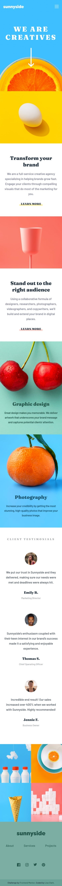

# Frontend Mentor - Sunnyside agency landing page solution

This is a solution to the [Sunnyside agency landing page challenge on Frontend Mentor](https://www.frontendmentor.io/challenges/sunnyside-agency-landing-page-7yVs3B6ef). Frontend Mentor challenges help you improve your coding skills by building realistic projects.

## Table of contents

- [Overview](#overview)
  - [The challenge](#the-challenge)
  - [Screenshots](#screenshots)
  - [Links](#links)
- [My process](#my-process)
  - [Built with](#built-with)
- [Author](#author)

## Overview

### The challenge

Users should be able to:

- View the optimal layout for the site depending on their device's screen size
- See hover states for all interactive elements on the page

### Screenshots

### Links

- Solution URL: [https://www.frontendmentor.io/solutions/responsive-landing-page-using-cssflexboxjs-X2i7EmfJc](https://www.frontendmentor.io/solutions/responsive-landing-page-using-cssflexboxjs-X2i7EmfJc)
- Live Site URL: [https://lisa-c-27.github.io/frontend-mentor-challenges/sunnyside-agency-landing-page-main/index.html](https://lisa-c-27.github.io/frontend-mentor-challenges/sunnyside-agency-landing-page-main/index.html)

## My process

### Built with

- Semantic HTML5 markup
- CSS custom properties
- Flexbox
- Mobile-first workflow
- JavaScript

## Author

- Frontend Mentor - [@Lisa-C-27](https://www.frontendmentor.io/profile/Lisa-C-27)