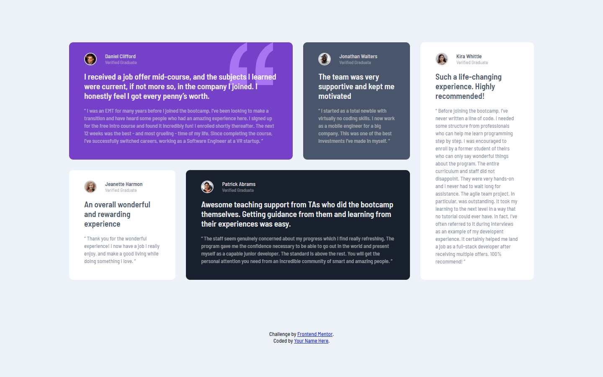

# Frontend Mentor - Testimonials grid section solution

This is a solution to the [Testimonials grid section challenge on Frontend Mentor](https://www.frontendmentor.io/challenges/testimonials-grid-section-Nnw6J7Un7). Frontend Mentor challenges help you improve your coding skills by building realistic projects. 

## Table of contents

- [Overview](#overview)
  - [The challenge](#the-challenge)
  - [Screenshot](#screenshot)
  - [Links](#links)
- [My process](#my-process)
  - [Built with](#built-with)
  - [Useful resources](#useful-resources)
- [Author](#author)

## Overview

### The challenge

Users should be able to:

- View the optimal layout for the site depending on their device's screen size

### Screenshot

### Links

- Solution URL: [https://www.frontendmentor.io/solutions/testimonials-section-using-grid-1ca8M13VR](https://www.frontendmentor.io/solutions/testimonials-section-using-grid-1ca8M13VR)
- Live Site URL: [https://lisa-c-27.github.io/frontend-mentor-challenges/testimonials-grid-section-main/index.html](https://lisa-c-27.github.io/frontend-mentor-challenges/testimonials-grid-section-main/index.html)

## My process

### Built with

- Semantic HTML5 markup
- CSS custom properties
- Flexbox
- CSS Grid
- Mobile-first workflow

### Useful resources

- [Grid Layout Generator](https://grid.layoutit.com/) - A grid layout generator, I used this to initially setup the grid for this project, but then modified it within my code to make adjustments as required
- [CSS Tricks - Grid guide](https://css-tricks.com/snippets/css/complete-guide-grid/) -  A complete guide to CSS grid by CSS Tricks

## Author

- Frontend Mentor - [@Lisa-C-27](https://www.frontendmentor.io/profile/Lisa-C-27)